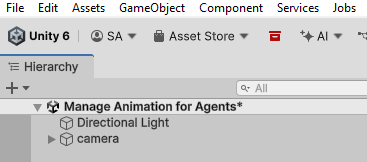
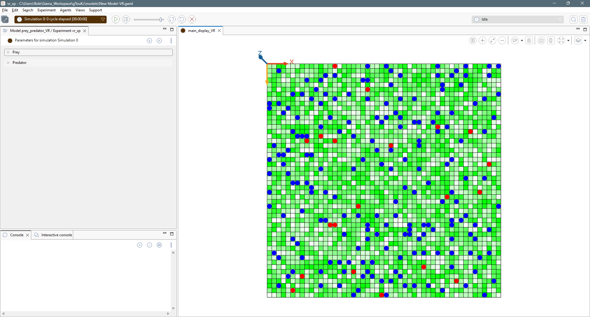
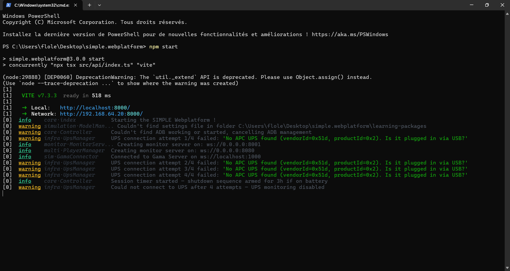
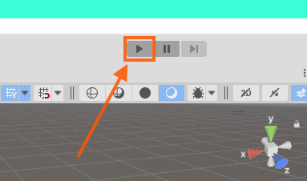
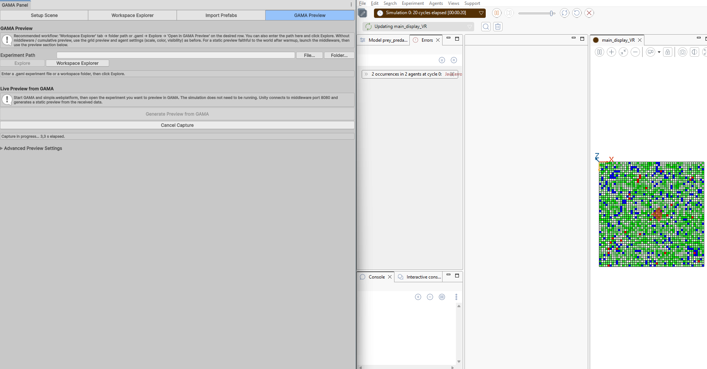
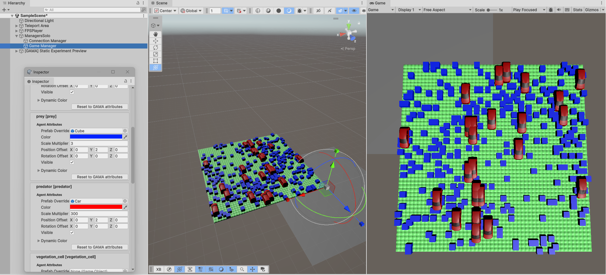
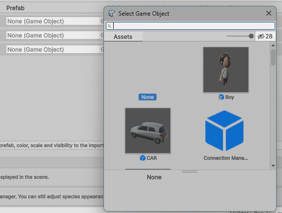
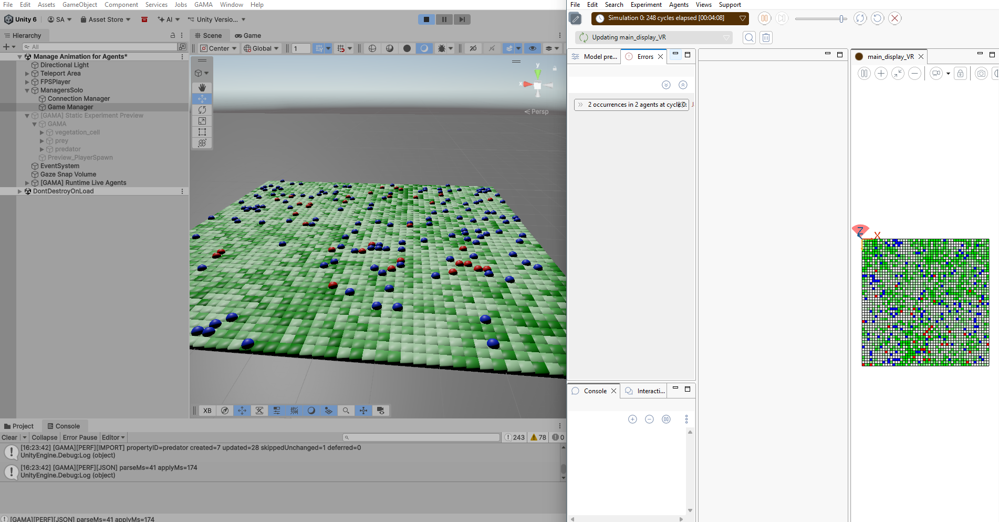
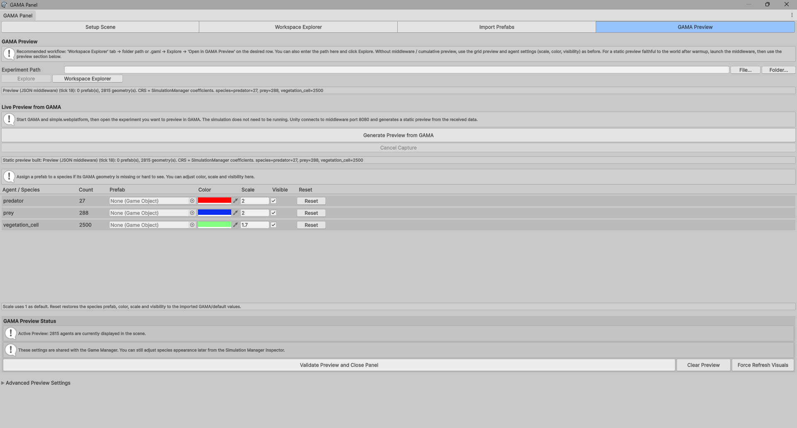
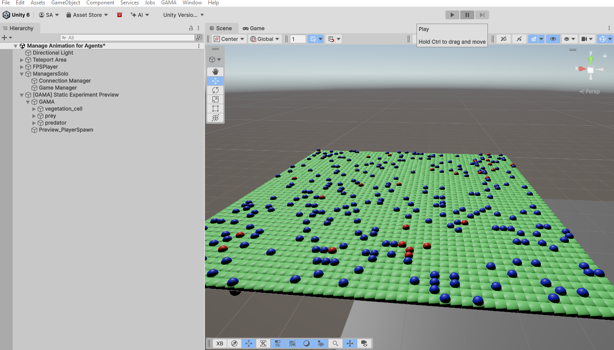

# Image Gallery

Use this page as a visual index for documentation images. Copy the path under each image directly into Markdown pages in `Documentation~/tutorial`.

## `../images/tutorial/01-create-new-unity-project.png`


```md
../images/tutorial/01-create-new-unity-project.png
```

## `../images/tutorial/01-gama-panel-open.png`


```md
../images/tutorial/01-gama-panel-open.png
```

## `../images/tutorial/01-open-gama-panel-menu.gif`


```md
../images/tutorial/01-open-gama-panel-menu.gif
```

## `../images/tutorial/01-package-installed.png`


```md
../images/tutorial/01-package-installed.png
```

## `../images/tutorial/01-package-manager-add-button.png`


```md
../images/tutorial/01-package-manager-add-button.png
```

## `../images/tutorial/01-package-manager-git-url.png`


```md
../images/tutorial/01-package-manager-git-url.png
```

## `../images/tutorial/01-package-manager-menu.png`


```md
../images/tutorial/01-package-manager-menu.png
```

## `../images/tutorial/01-package-manager-window.png`



```md
../images/tutorial/01-package-manager-window.png
```

## `../images/tutorial/01-scene-ready-for-middleware.png`


```md
../images/tutorial/01-scene-ready-for-middleware.png
```

## `../images/tutorial/01-setup-scene-button.png`


```md
../images/tutorial/01-setup-scene-button.png
```

## `../images/tutorial/01-unity-home.png`


```md
../images/tutorial/01-unity-home.png
```

## `../images/tutorial/01-unity-project-ready.png`


```md
../images/tutorial/01-unity-project-ready.png
```

## `../images/tutorial/01-unity-version-create-project.png`


```md
../images/tutorial/01-unity-version-create-project.png
```

## `../images/tutorial/02-agents-grouped-by-species.png`


```md
../images/tutorial/02-agents-grouped-by-species.png
```

## `../images/tutorial/02-gama-new-tab.png`


```md
../images/tutorial/02-gama-new-tab.png
```

## `../images/tutorial/02-open-gama-experiment.png`



```md
../images/tutorial/02-open-gama-experiment.png
```

## `../images/tutorial/02-open-middleware.png`



```md
../images/tutorial/02-open-middleware.png
```

## `../images/tutorial/02-prey-predator-7-location.png`


```md
../images/tutorial/02-prey-predator-7-location.png
```

## `../images/tutorial/02-runtime-live-overview.png`


```md
../images/tutorial/02-runtime-live-overview.png
```

## `../images/tutorial/02-unity-play-mode-button.png`



```md
../images/tutorial/02-unity-play-mode-button.png
```

## `../images/tutorial/02-unity-play-mode-button-cropped.png`


```md
../images/tutorial/02-unity-play-mode-button-cropped.png
```

## `../images/tutorial/02-windows-overview-gama-unity.png`


```md
../images/tutorial/02-windows-overview-gama-unity.png
```

## `../images/tutorial/03-gama-preview-page.png`


```md
../images/tutorial/03-gama-preview-page.png
```

## `../images/tutorial/03-gama-running-during-preview-capture.png`



```md
../images/tutorial/03-gama-running-during-preview-capture.png
```

## `../images/tutorial/03-generate-preview-button.png`


```md
../images/tutorial/03-generate-preview-button.png
```

## `../images/tutorial/03-open-gama-preview-menu.png`


```md
../images/tutorial/03-open-gama-preview-menu.png
```

## `../images/tutorial/03-play-mode-personalization-example.png`



```md
../images/tutorial/03-play-mode-personalization-example.png
```

## `../images/tutorial/03-preview-building-panel.png`


```md
../images/tutorial/03-preview-building-panel.png
```

## `../images/tutorial/03-preview-captured-species-settings.png`


```md
../images/tutorial/03-preview-captured-species-settings.png
```

## `../images/tutorial/03-static-preview-scene-built.png`


```md
../images/tutorial/03-static-preview-scene-built.png
```

## `../images/tutorial/03-wait-preview-building.png`


```md
../images/tutorial/03-wait-preview-building.png
```

## `../images/tutorial/04-change-prefab-from-gama-panel.png`



```md
../images/tutorial/04-change-prefab-from-gama-panel.png
```

## `../images/tutorial/04-preview-colored-agents-result.png`


```md
../images/tutorial/04-preview-colored-agents-result.png
```

## `../images/tutorial/04-preview-colored-agents-settings.png`


```md
../images/tutorial/04-preview-colored-agents-settings.png
```

## `../images/tutorial/04-preview-gray-agents-result.png`


```md
../images/tutorial/04-preview-gray-agents-result.png
```

## `../images/tutorial/04-preview-gray-agents-settings.png`


```md
../images/tutorial/04-preview-gray-agents-settings.png
```

## `../images/tutorial/04-preview-vegetation-only.png`


```md
../images/tutorial/04-preview-vegetation-only.png
```

## `../images/tutorial/04-preview-vegetation-settings.png`


```md
../images/tutorial/04-preview-vegetation-settings.png
```

## `../images/tutorial/05-play-mode-runtime-preview-hidden.png`



```md
../images/tutorial/05-play-mode-runtime-preview-hidden.png
```

## `../images/tutorial/05-press-play-from-preview.png`


```md
../images/tutorial/05-press-play-from-preview.png
```

## `../images/tutorial/05-validate-preview-button.png`



```md
../images/tutorial/05-validate-preview-button.png
```

## `../images/tutorial/Capture%20d%E2%80%99%C3%A9cran%202026-06-18%20160138.paint`

No Markdown preview for this file type.

```md
../images/tutorial/Capture%20d%E2%80%99%C3%A9cran%202026-06-18%20160138.paint
```

## `../images/tutorial/Capture%20d%E2%80%99%C3%A9cranrzerzerzer%202026-06-18%20164953.paint`

No Markdown preview for this file type.

```md
../images/tutorial/Capture%20d%E2%80%99%C3%A9cranrzerzerzer%202026-06-18%20164953.paint
```

## `../images/tutorial/Capture%20d'%C3%A9cran%2012026-06-18%20161220.png`


```md
../images/tutorial/Capture%20d'%C3%A9cran%2012026-06-18%20161220.png
```

## `../images/tutorial/Capture%20d'%C3%A9cran%202026-06-16%20104153.png`


```md
../images/tutorial/Capture%20d'%C3%A9cran%202026-06-16%20104153.png
```

## `../images/tutorial/Capture%20d'%C3%A9cran%202026-06-16%20104829.png`


```md
../images/tutorial/Capture%20d'%C3%A9cran%202026-06-16%20104829.png
```

## `../images/tutorial/Capture%20d'%C3%A9cran%202026-06-16%20104908.png`


```md
../images/tutorial/Capture%20d'%C3%A9cran%202026-06-16%20104908.png
```

## `../images/tutorial/Capture%20d'%C3%A9cran%202026-06-16%20105521.png`


```md
../images/tutorial/Capture%20d'%C3%A9cran%202026-06-16%20105521.png
```

## `../images/tutorial/Capture%20d'%C3%A9cran%202026-06-16%20110449.png`


```md
../images/tutorial/Capture%20d'%C3%A9cran%202026-06-16%20110449.png
```

## `../images/tutorial/Capture%20d'%C3%A9cran%202026-06-16%20110610.png`


```md
../images/tutorial/Capture%20d'%C3%A9cran%202026-06-16%20110610.png
```

## `../images/tutorial/Capture%20d'%C3%A9cran%202026-06-16%20110803.png`


```md
../images/tutorial/Capture%20d'%C3%A9cran%202026-06-16%20110803.png
```

## `../images/tutorial/Capture%20d'%C3%A9cran%202026-06-16%20111035.png`


```md
../images/tutorial/Capture%20d'%C3%A9cran%202026-06-16%20111035.png
```

## `../images/tutorial/Capture%20d'%C3%A9cran%202026-06-16%20112318.png`


```md
../images/tutorial/Capture%20d'%C3%A9cran%202026-06-16%20112318.png
```

## `../images/tutorial/Capture%20d'%C3%A9cran%202026-06-16%20112333.png`


```md
../images/tutorial/Capture%20d'%C3%A9cran%202026-06-16%20112333.png
```

## `../images/tutorial/Capture%20d'%C3%A9cran%202026-06-16%20113853.png`


```md
../images/tutorial/Capture%20d'%C3%A9cran%202026-06-16%20113853.png
```

## `../images/tutorial/Capture%20d'%C3%A9cran%202026-06-16%20113906.png`


```md
../images/tutorial/Capture%20d'%C3%A9cran%202026-06-16%20113906.png
```

## `../images/tutorial/Capture%20d'%C3%A9cran%202026-06-16%20113912.png`


```md
../images/tutorial/Capture%20d'%C3%A9cran%202026-06-16%20113912.png
```

## `../images/tutorial/Capture%20d'%C3%A9cran%202026-06-16%20114855.png`


```md
../images/tutorial/Capture%20d'%C3%A9cran%202026-06-16%20114855.png
```

## `../images/tutorial/Capture%20d'%C3%A9cran%202026-06-16%20114917.png`


```md
../images/tutorial/Capture%20d'%C3%A9cran%202026-06-16%20114917.png
```

## `../images/tutorial/Capture%20d'%C3%A9cran%202026-06-16%20120934.png`


```md
../images/tutorial/Capture%20d'%C3%A9cran%202026-06-16%20120934.png
```

## `../images/tutorial/Capture%20d'%C3%A9cran%202026-06-16%20120941.png`


```md
../images/tutorial/Capture%20d'%C3%A9cran%202026-06-16%20120941.png
```

## `../images/tutorial/Capture%20d'%C3%A9cran%202026-06-16%20150026.png`


```md
../images/tutorial/Capture%20d'%C3%A9cran%202026-06-16%20150026.png
```

## `../images/tutorial/Capture%20d'%C3%A9cran%202026-06-16%20151400.png`


```md
../images/tutorial/Capture%20d'%C3%A9cran%202026-06-16%20151400.png
```

## `../images/tutorial/Capture%20d'%C3%A9cran%202026-06-16%20152833.png`


```md
../images/tutorial/Capture%20d'%C3%A9cran%202026-06-16%20152833.png
```

## `../images/tutorial/Capture%20d'%C3%A9cran%202026-06-16%20152904.png`


```md
../images/tutorial/Capture%20d'%C3%A9cran%202026-06-16%20152904.png
```

## `../images/tutorial/Capture%20d'%C3%A9cran%202026-06-16%20164250.png`


```md
../images/tutorial/Capture%20d'%C3%A9cran%202026-06-16%20164250.png
```

## `../images/tutorial/Capture%20d'%C3%A9cran%202026-06-17%20104401.png`


```md
../images/tutorial/Capture%20d'%C3%A9cran%202026-06-17%20104401.png
```

## `../images/tutorial/Capture%20d'%C3%A9cran%202026-06-17%20104651.png`


```md
../images/tutorial/Capture%20d'%C3%A9cran%202026-06-17%20104651.png
```

## `../images/tutorial/Capture%20d'%C3%A9cran%202026-06-17%20113459.png`


```md
../images/tutorial/Capture%20d'%C3%A9cran%202026-06-17%20113459.png
```

## `../images/tutorial/Capture%20d'%C3%A9cran%202026-06-17%20114732.png`


```md
../images/tutorial/Capture%20d'%C3%A9cran%202026-06-17%20114732.png
```

## `../images/tutorial/Capture%20d'%C3%A9cran%202026-06-17%20114740.png`


```md
../images/tutorial/Capture%20d'%C3%A9cran%202026-06-17%20114740.png
```

## `../images/tutorial/Capture%20d'%C3%A9cran%202026-06-17%20133606.png`


```md
../images/tutorial/Capture%20d'%C3%A9cran%202026-06-17%20133606.png
```

## `../images/tutorial/Capture%20d'%C3%A9cran%202026-06-17%20145006.png`


```md
../images/tutorial/Capture%20d'%C3%A9cran%202026-06-17%20145006.png
```

## `../images/tutorial/Capture%20d'%C3%A9cran%202026-06-18%20101858.png`


```md
../images/tutorial/Capture%20d'%C3%A9cran%202026-06-18%20101858.png
```

## `../images/tutorial/Capture%20d'%C3%A9cran%202026-06-18%20103941.png`


```md
../images/tutorial/Capture%20d'%C3%A9cran%202026-06-18%20103941.png
```

## `../images/tutorial/Capture%20d'%C3%A9cran%202026-06-18%20105227.png`


```md
../images/tutorial/Capture%20d'%C3%A9cran%202026-06-18%20105227.png
```

## `../images/tutorial/Capture%20d'%C3%A9cran%202026-06-18%20105231.png`


```md
../images/tutorial/Capture%20d'%C3%A9cran%202026-06-18%20105231.png
```

## `../images/tutorial/Capture%20d'%C3%A9cran%202026-06-18%20105808.png`


```md
../images/tutorial/Capture%20d'%C3%A9cran%202026-06-18%20105808.png
```

## `../images/tutorial/Capture%20d'%C3%A9cran%202026-06-18%20105820.png`


```md
../images/tutorial/Capture%20d'%C3%A9cran%202026-06-18%20105820.png
```

## `../images/tutorial/Capture%20d'%C3%A9cran%202026-06-18%20105832.png`


```md
../images/tutorial/Capture%20d'%C3%A9cran%202026-06-18%20105832.png
```

## `../images/tutorial/Capture%20d'%C3%A9cran%202026-06-18%20110417.png`


```md
../images/tutorial/Capture%20d'%C3%A9cran%202026-06-18%20110417.png
```

## `../images/tutorial/Capture%20d'%C3%A9cran%202026-06-18%20110726.png`


```md
../images/tutorial/Capture%20d'%C3%A9cran%202026-06-18%20110726.png
```

## `../images/tutorial/Capture%20d'%C3%A9cran%202026-06-18%20112147.png`


```md
../images/tutorial/Capture%20d'%C3%A9cran%202026-06-18%20112147.png
```

## `../images/tutorial/Capture%20d'%C3%A9cran%202026-06-18%20112304.png`


```md
../images/tutorial/Capture%20d'%C3%A9cran%202026-06-18%20112304.png
```

## `../images/tutorial/Capture%20d'%C3%A9cran%202026-06-18%20112741.png`


```md
../images/tutorial/Capture%20d'%C3%A9cran%202026-06-18%20112741.png
```

## `../images/tutorial/Capture%20d'%C3%A9cran%202026-06-18%20114513.png`


```md
../images/tutorial/Capture%20d'%C3%A9cran%202026-06-18%20114513.png
```

## `../images/tutorial/Capture%20d'%C3%A9cran%202026-06-18%20115735.png`


```md
../images/tutorial/Capture%20d'%C3%A9cran%202026-06-18%20115735.png
```

## `../images/tutorial/Capture%20d'%C3%A9cran%202026-06-18%20120151.png`


```md
../images/tutorial/Capture%20d'%C3%A9cran%202026-06-18%20120151.png
```

## `../images/tutorial/Capture%20d'%C3%A9cran%202026-06-18%20120223.png`


```md
../images/tutorial/Capture%20d'%C3%A9cran%202026-06-18%20120223.png
```

## `../images/tutorial/Capture%20d'%C3%A9cran%202026-06-18%20120248.png`


```md
../images/tutorial/Capture%20d'%C3%A9cran%202026-06-18%20120248.png
```

## `../images/tutorial/Capture%20d'%C3%A9cran%202026-06-18%20120553.png`


```md
../images/tutorial/Capture%20d'%C3%A9cran%202026-06-18%20120553.png
```

## `../images/tutorial/Capture%20d'%C3%A9cran%202026-06-18%20155723.png`


```md
../images/tutorial/Capture%20d'%C3%A9cran%202026-06-18%20155723.png
```

## `../images/tutorial/Capture%20d'%C3%A9cran%202026-06-18%20155733.png`


```md
../images/tutorial/Capture%20d'%C3%A9cran%202026-06-18%20155733.png
```

## `../images/tutorial/Capture%20d'%C3%A9cran%202026-06-18%20155747.png`


```md
../images/tutorial/Capture%20d'%C3%A9cran%202026-06-18%20155747.png
```

## `../images/tutorial/Capture%20d'%C3%A9cran%202026-06-18%20155810.png`


```md
../images/tutorial/Capture%20d'%C3%A9cran%202026-06-18%20155810.png
```

## `../images/tutorial/Capture%20d'%C3%A9cran%202026-06-18%20155839.png`


```md
../images/tutorial/Capture%20d'%C3%A9cran%202026-06-18%20155839.png
```

## `../images/tutorial/Capture%20d'%C3%A9cran%202026-06-18%20155847.png`


```md
../images/tutorial/Capture%20d'%C3%A9cran%202026-06-18%20155847.png
```

## `../images/tutorial/Capture%20d'%C3%A9cran%202026-06-18%20155905.png`


```md
../images/tutorial/Capture%20d'%C3%A9cran%202026-06-18%20155905.png
```

## `../images/tutorial/Capture%20d'%C3%A9cran%202026-06-18%20155942.png`


```md
../images/tutorial/Capture%20d'%C3%A9cran%202026-06-18%20155942.png
```

## `../images/tutorial/Capture%20d'%C3%A9cran%202026-06-18%20161220.png`


```md
../images/tutorial/Capture%20d'%C3%A9cran%202026-06-18%20161220.png
```

## `../images/tutorial/Capture%20d'%C3%A9cran%202026-06-18%20161318.png`


```md
../images/tutorial/Capture%20d'%C3%A9cran%202026-06-18%20161318.png
```

## `../images/tutorial/Capture%20d'%C3%A9cran%202026-06-18%20161333.png`


```md
../images/tutorial/Capture%20d'%C3%A9cran%202026-06-18%20161333.png
```

## `../images/tutorial/Capture%20d'%C3%A9cran%202026-06-18%20161411.png`


```md
../images/tutorial/Capture%20d'%C3%A9cran%202026-06-18%20161411.png
```

## `../images/tutorial/Capture%20d'%C3%A9cran%202026-06-18%20161524.png`


```md
../images/tutorial/Capture%20d'%C3%A9cran%202026-06-18%20161524.png
```

## `../images/tutorial/Capture%20d'%C3%A9cran%202026-06-18%20161631.png`


```md
../images/tutorial/Capture%20d'%C3%A9cran%202026-06-18%20161631.png
```

## `../images/tutorial/Capture%20d'%C3%A9cran%202026-06-18%20161833.png`


```md
../images/tutorial/Capture%20d'%C3%A9cran%202026-06-18%20161833.png
```

## `../images/tutorial/Capture%20d'%C3%A9cran%202026-06-18%20162223.png`


```md
../images/tutorial/Capture%20d'%C3%A9cran%202026-06-18%20162223.png
```

## `../images/tutorial/Capture%20d'%C3%A9cran%202026-06-18%20163019.png`


```md
../images/tutorial/Capture%20d'%C3%A9cran%202026-06-18%20163019.png
```

## `../images/tutorial/Capture%20d'%C3%A9cran%202026-06-18%20163429.png`


```md
../images/tutorial/Capture%20d'%C3%A9cran%202026-06-18%20163429.png
```

## `../images/tutorial/Capture%20d'%C3%A9cran%202026-06-18%20163632.png`


```md
../images/tutorial/Capture%20d'%C3%A9cran%202026-06-18%20163632.png
```

## `../images/tutorial/Capture%20d'%C3%A9cran%202026-06-18%20163712.png`


```md
../images/tutorial/Capture%20d'%C3%A9cran%202026-06-18%20163712.png
```

## `../images/tutorial/Capture%20d'%C3%A9cran%202026-06-18%20164722.png`


```md
../images/tutorial/Capture%20d'%C3%A9cran%202026-06-18%20164722.png
```

## `../images/tutorial/Capture%20d'%C3%A9cran%202026-06-18%20164753.png`


```md
../images/tutorial/Capture%20d'%C3%A9cran%202026-06-18%20164753.png
```

## `../images/tutorial/Capture%20d'%C3%A9cran%202026-06-18%20164833.png`


```md
../images/tutorial/Capture%20d'%C3%A9cran%202026-06-18%20164833.png
```

## `../images/tutorial/Capture%20d'%C3%A9cran%202026-06-18%20165406.png`


```md
../images/tutorial/Capture%20d'%C3%A9cran%202026-06-18%20165406.png
```

## `../images/tutorial/Capture%20d'%C3%A9cran%202026-06-18%20165617.png`


```md
../images/tutorial/Capture%20d'%C3%A9cran%202026-06-18%20165617.png
```

## `../images/tutorial/Capture%20d'%C3%A9cran%202026-06fcsdfcsfcs-18%20163429.paint`

No Markdown preview for this file type.

```md
../images/tutorial/Capture%20d'%C3%A9cran%202026-06fcsdfcsfcs-18%20163429.paint
```

## `../images/tutorial/Capture%20d'%C3%A9cran%202026-06-wscwxcw18%20161524.png`


```md
../images/tutorial/Capture%20d'%C3%A9cran%202026-06-wscwxcw18%20161524.png
```

## `../images/tutorial/Capture%20d'%C3%A9cran%202026-0dfgedfgdfg6-18%20161333.png`


```md
../images/tutorial/Capture%20d'%C3%A9cran%202026-0dfgedfgdfg6-18%20161333.png
```

## `../images/tutorial/Capture%20d'%C3%A9cran%2020fsfsdfsdqsdqsdqdqz26-06-18%20161411.png`


```md
../images/tutorial/Capture%20d'%C3%A9cran%2020fsfsdfsdqsdqsdqdqz26-06-18%20161411.png
```

## `../images/tutorial/Capture%20d'%C3%A9cran%2020fsfsdfsz26-06-18%20161411.png`


```md
../images/tutorial/Capture%20d'%C3%A9cran%2020fsfsdfsz26-06-18%20161411.png
```

## `../images/tutorial/misc-capture-2026-05-27-154202.png`


```md
../images/tutorial/misc-capture-2026-05-27-154202.png
```

## `../images/tutorial/misc-capture-2026-05-27-154914.png`


```md
../images/tutorial/misc-capture-2026-05-27-154914.png
```

## `../images/tutorial/misc-capture-2026-05-27-154929.png`


```md
../images/tutorial/misc-capture-2026-05-27-154929.png
```

## `../images/tutorial/misc-capture-2026-05-27-162201.png`



```md
../images/tutorial/misc-capture-2026-05-27-162201.png
```
