# 1. Install the Unity Package

This chapter installs the SIMPLE Unity Plugin in a Unity project and prepares the
scene for GAMA communication.

## Create Or Open A Unity Project

Start by creating a new Unity project.

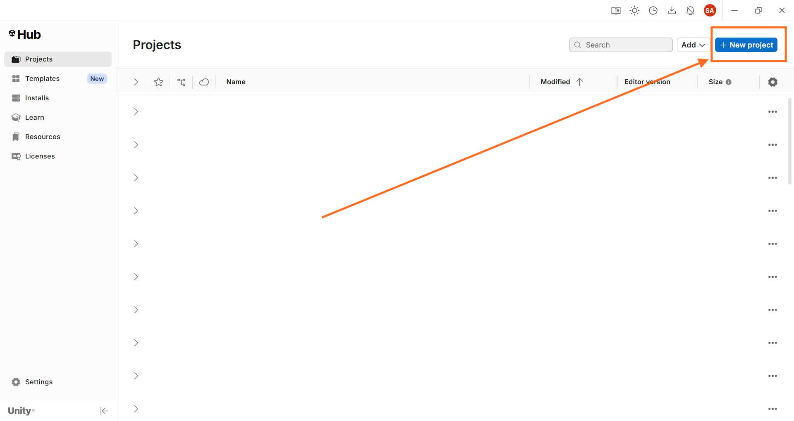

Check the choosen Unity version and Create project (you don't have to choose a perticular kind of projetc).

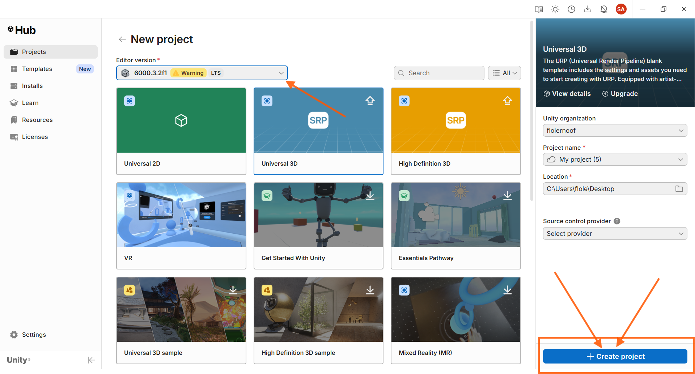

Wait until Unity finishes building the scene...


After the project opens, you should be on the Unity home/editor screen.

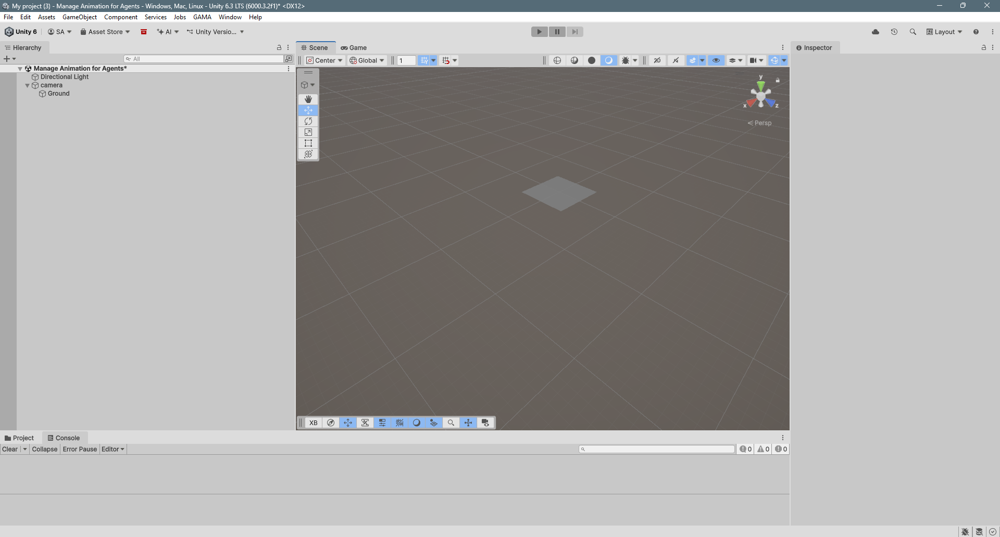

## Install From GitHub

1. Open Unity.
2. Open **Window > Package Manager**.
3. Click **+**.
4. Select **Add package from git URL...**.
5. Enter:

```text
https://github.com/project-SIMPLE/SIMPLE-Unity-Plugin.git
```

To install a specific branch:

```text
https://github.com/project-SIMPLE/SIMPLE-Unity-Plugin.git#branch-name
```

Open the Package Manager from Unity.

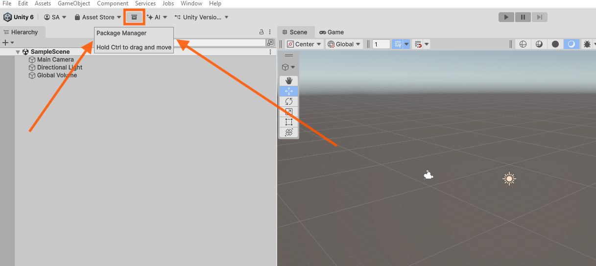

Click the **+** button.

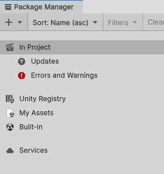

Paste the Git URL.

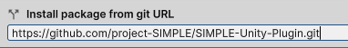

After installation, the package appears in the Package Manager.

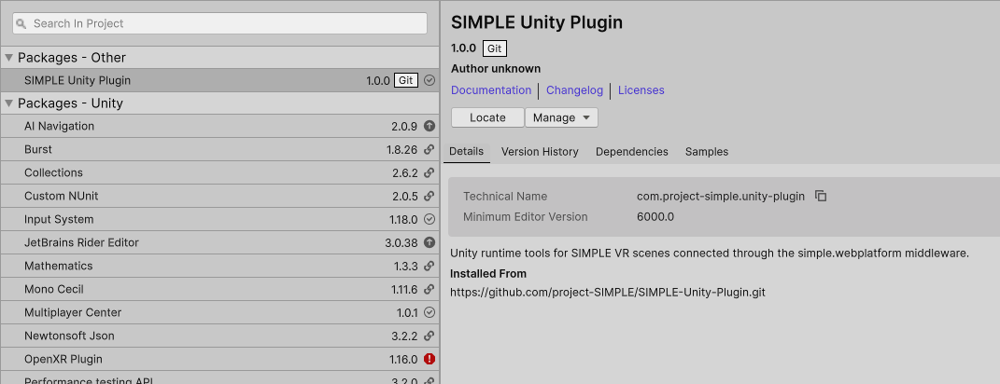

## Install From Local Disk

For local development:

1. Open **Window > Package Manager**.
2. Click **+**.
3. Select **Add package from disk...**.
4. Select the package `package.json`.

> and the package `package.json` selected.

## Setup The Unity Scene

1. Open **GAMA > GAMA Panel**.
2. Click **Setup Scene**.
3. Verify that the scene contains:
   - a player or camera rig;
   - a `Connection Manager`;
   - a `Game Manager`;
   - required scene roots for preview and runtime objects.

Open the GAMA Panel from the Unity menu.


The GAMA Panel opens with the main preview and setup controls.

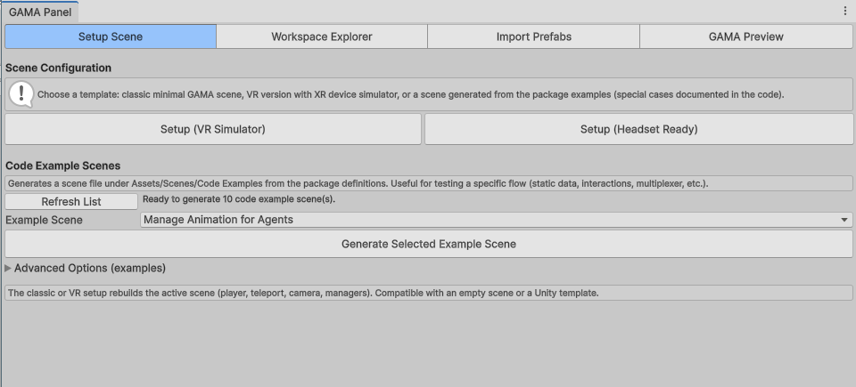

Use **Setup Scene** when starting from an empty scene.

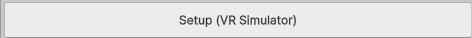

After setup, the scene contains the objects needed to communicate with the
middleware.

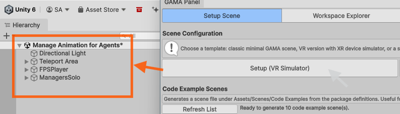

The Unity project is ready for the preview workflow.

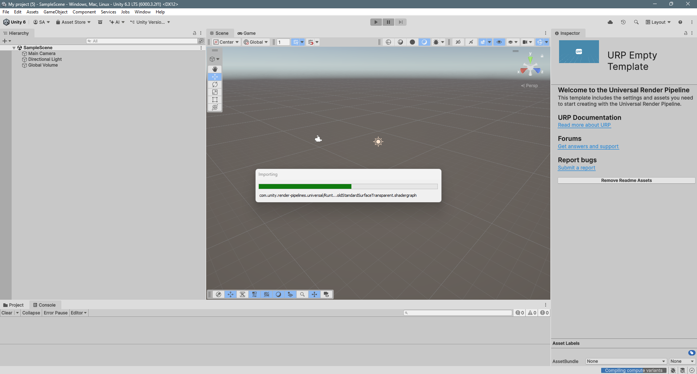

## Middleware Requirements

Start `simple.webplatform` before generating a preview or entering Play Mode.

Default endpoints:

```text
Unity runtime / headset WebSocket: ws://localhost:8080/
Monitor WebSocket: ws://localhost:8001/
GAMA Server behind webplatform: ws://localhost:1000/
```

## Result

At the end of this chapter, Unity is ready to communicate with the middleware.
