# 1. Install the Unity Package

This chapter installs the SIMPLE Unity Plugin in a Unity project and prepares the
scene for GAMA communication.

## Create and Open a Unity Project

Start by creating a new Unity project.

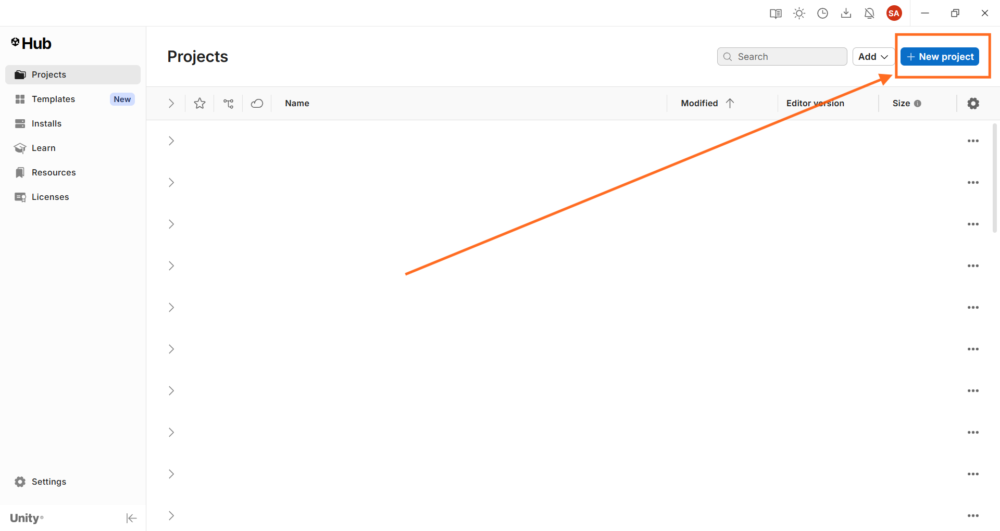

Check the choosen Unity version and Create project (you don't have to choose a perticular kind of projetc).

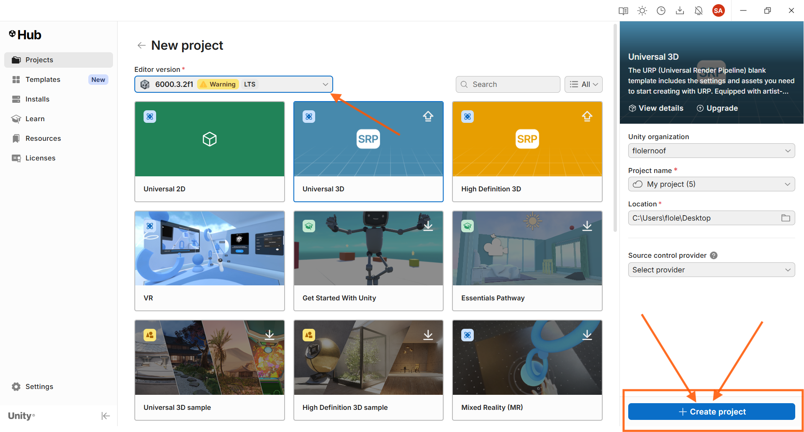

Wait until Unity finishes building the scene...

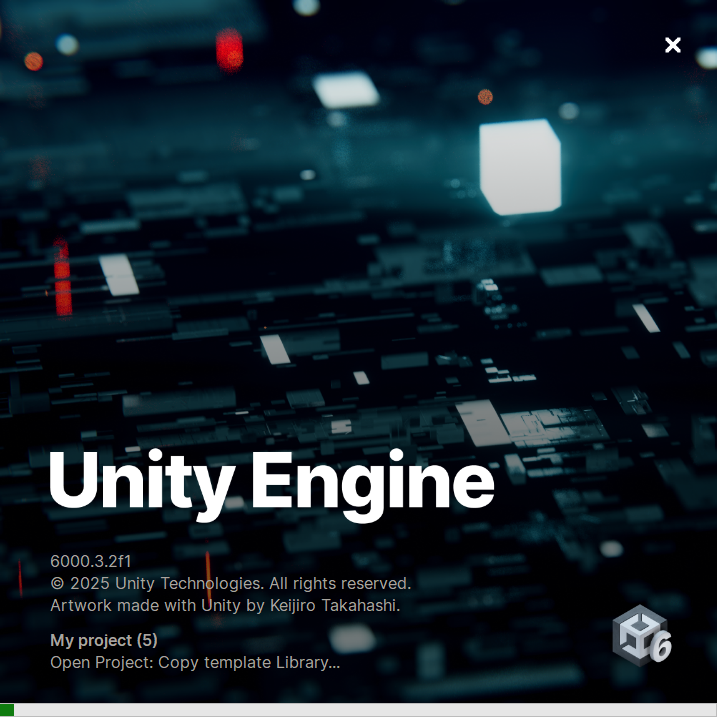

After the project opens, you should be on the Unity home/editor screen.

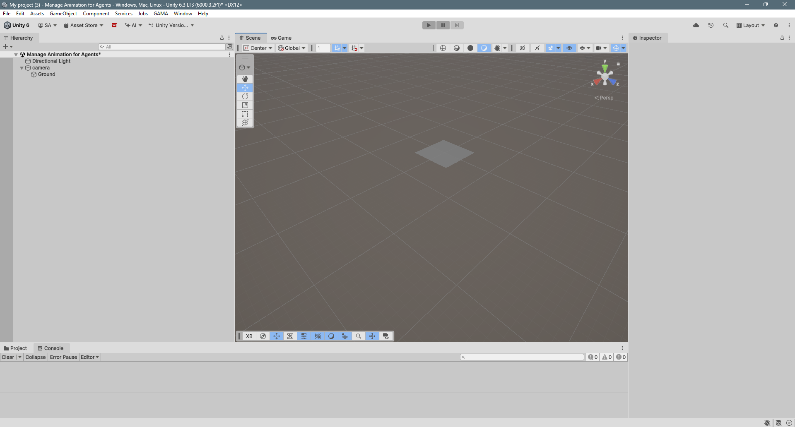

## Install the Package...
### ...From GitHub

1. Open the Package Manager from Unity.

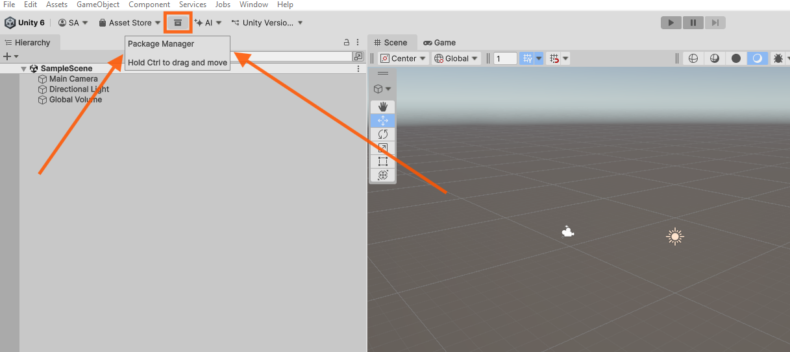

3. Click the **+** button.

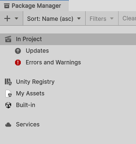

5. Select **Add package from git URL...**.

6. Enter:

```text
https://github.com/project-SIMPLE/SIMPLE-Unity-Plugin.git
```

To install a specific branch:

```text
https://github.com/project-SIMPLE/SIMPLE-Unity-Plugin.git#branch-name
```
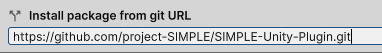

7. After installation, the package should appear in the Package Manager.

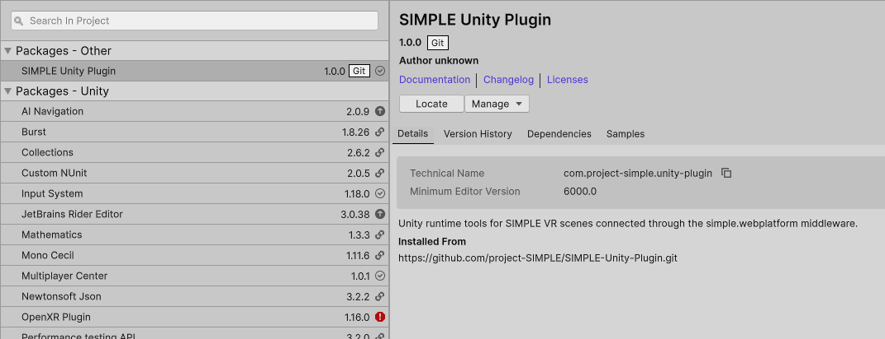

### ...From Local Disk

For local development:

1. After clicking on **+** select **Add package from disk...**.
2. Select the package `package.json` file from your local package folder.

## Setup The Unity Scene

1. Open **GAMA > GAMA Panel**.

3. Click **Setup Scene**. 

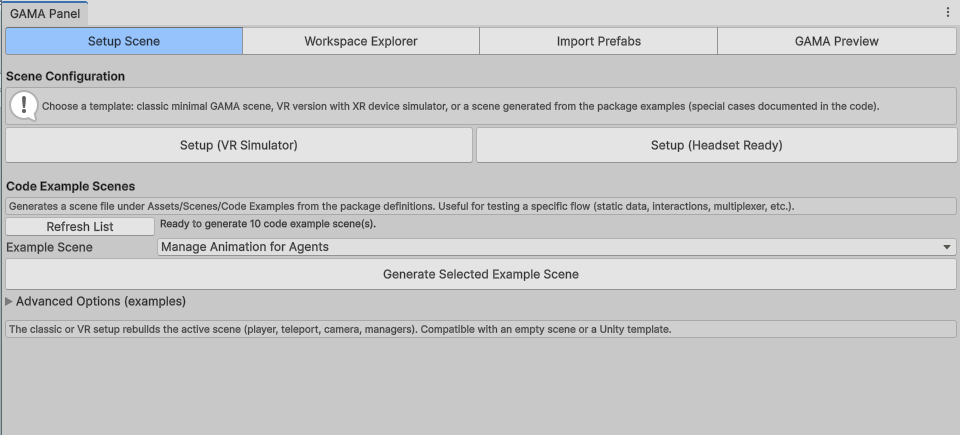

4. After a quick build...
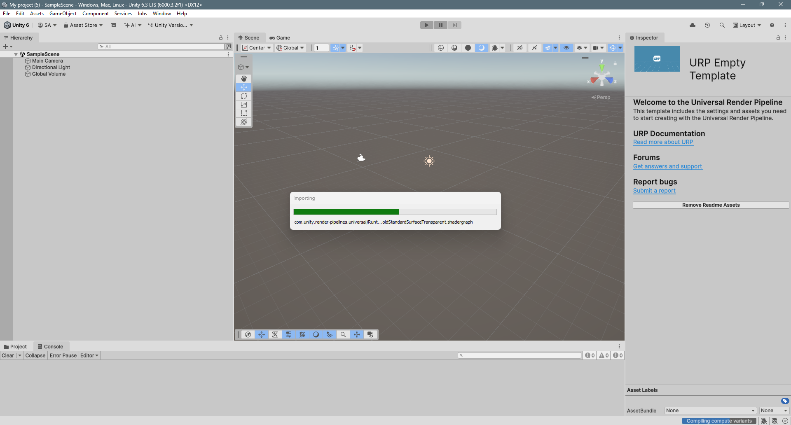

...your scene should contain every object needed to communicate with the middleware.
You can verify that the scene contains:
   - a player or camera rig;
   - a `Connection Manager`;
   - a `Game Manager`;
   - required scene roots for preview and runtime objects.
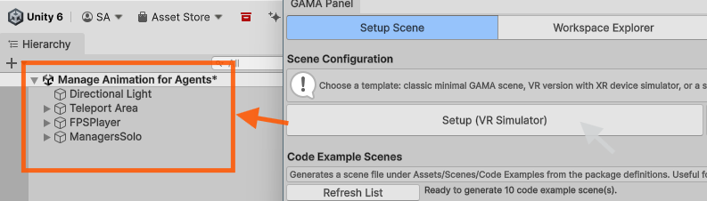


## Result

At the end of this chapter, Unity is ready to communicate with the middleware.
