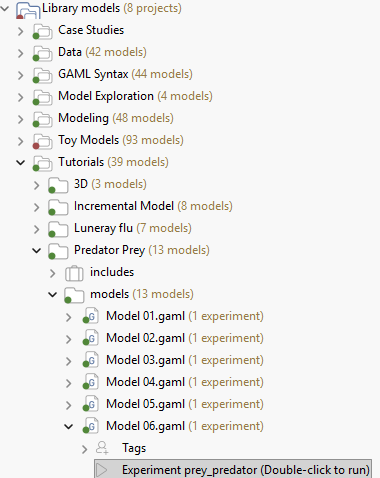
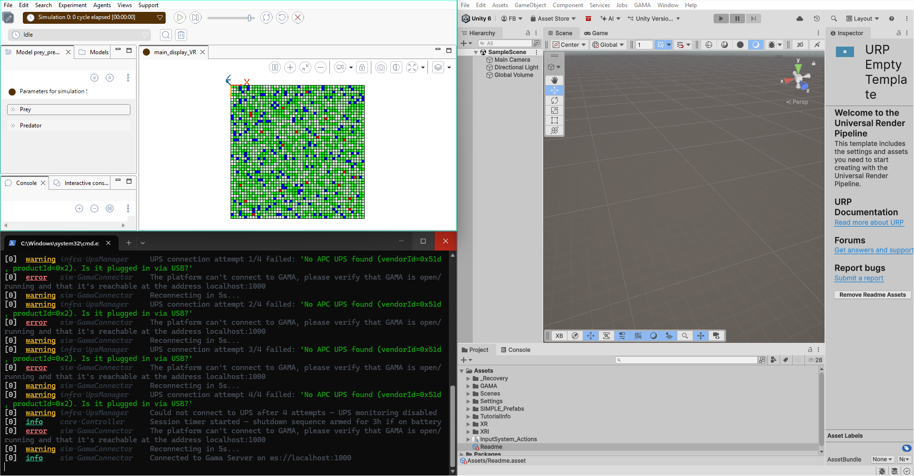
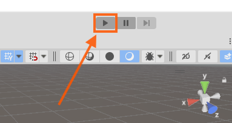
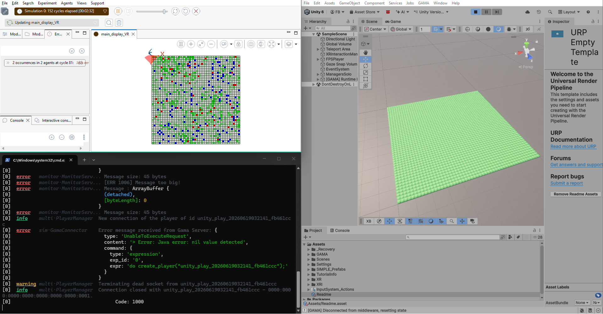
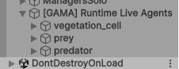

# 2. Run the GAMA Experiment in Play Mode

It is time to run the first GAMA experiment in Unity with this package. In this
tutorial, use the 6th **Prey Predator** model located in the following hierarchy from GAMA.



This experiment is used throughout the rest of the tutorial because it covers the
main features provided by the package: static background species, dynamic agents,
species-specific rendering, live updates, and interaction with Unity objects.

This chapter validates the baseline live workflow: Unity enters Play Mode,
connects to `simple.webplatform`, receives the running GAMA simulation, and
creates Unity objects from the GAMA agents.

## 2.1 Steps

1. Make sure the scene was prepared with **GAMA > GAMA Panel > Setup Scene**.
2. Start `simple.webplatform` with  `npm start`
3. Open and run the **Prey Predator 7** experiment in GAMA.


4. Press **Play** in Unity.



Runtime agents are created under:

```text
[GAMA] Runtime Live Agents
```

When Play Mode works, Unity receives live objects from GAMA and updates them
while the experiment is running.



## 2.2 Expected Result

During Play Mode, Unity should connect to `simple.webplatform` and create live
Unity objects from the agents received from the **Prey Predator 7** model.

The imported agents are grouped by species in the Unity hierarchy.



At this stage, the important result is that the connection works and that GAMA
agents are imported into Unity while the experiment is running.

## 2.3 Into the Next Step

This is already useful: we now have a functional connection between GAMA,
`simple.webplatform`, and Unity. The **Prey Predator 7** agents are imported and
converted into Unity objects automatically.

However, the raw Unity rendering is still not clear enough to understand the
experiment visually. At this point, objects are created blindly: they exist in
the scene, but their default appearance does not make the simulation easy to
read.

The next step of the tutorial focuses on Play Mode personalization. The goal is
to adjust the visual parameters of the imported objects directly in Unity so the
Prey Predator experiment becomes readable while it is running.
