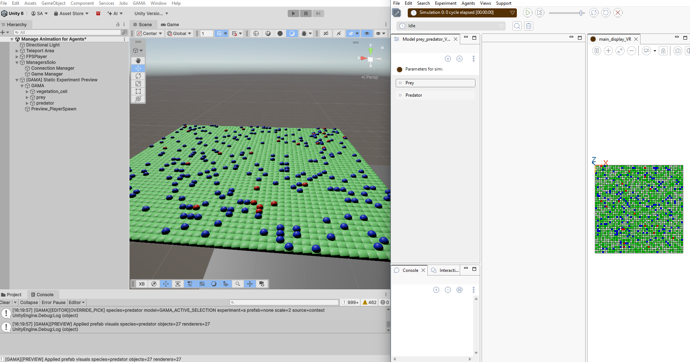

# 2. Run the GAMA Experiment in Play Mode

It is time to run our first experiment in Unity with this package. It is a way to first validate that the live runtime workflow corresponding to a certain experiment
works from a clean Unity scene.

This chapter shows the baseline behavior: Unity enters Play Mode, connects to
`simple.webplatform`, receives the live GAMA simulation, and creates runtime
objects in the scene.

## 2.1 Steps

1. Make sure the scene was prepared with **GAMA > GAMA Panel > Setup Scene**.
2. Start `simple.webplatform` with  `npm start`
3. Open the target experiment in GAMA.

//Mettre une screen des 3 pages ouvertes en simultané les unes a côté des autres toutes en mmee temps dans un seul écran

4. Press **Play** in Unity.

//mettre une photo por trouver le modeplay

Runtime agents are created under:

```text
[GAMA] Runtime Live Agents
```

When Play Mode works, Unity receives live objects from GAMA and updates them
while the experiment is running.



## 2.2 Expected Result

During Play Mode:

- Unity connects to `simple.webplatform`;
- live agents are created, updated, and removed by stable agent id;
- static background species and dynamic agents are grouped by species;
- the Unity player or camera position can be sent back to GAMA when configured.

Dynamic agents should be synchronized by:

```text
speciesName + "::" + agentId
```

Expected behavior:

- existing agents update instead of duplicating;
- newborn agents appear;
- dead agents disappear after a complete live update;
- static/background species are not pruned just because they are absent from a
  dynamic tick.

## 2.3 Into the Next Step

This direct Play Mode workflow proves that the connection works, but it is slow
for visual iteration.

Every time you want to check whether a species has the right prefab, scale,
color, visibility, or offset, you need to run the experiment again. That is why
the next chapter introduces the Editor preview: it lets you build a static
snapshot of the experiment in Unity, adjust the visual parameters there, and then
reuse those settings in Play Mode.

## Navigation

| Previous | Next |
|---|---|
| [Installation and Setup](01-installation-and-setup.md) | [Generate a Preview from GAMA](03-generate-preview.md) |
