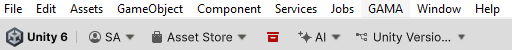
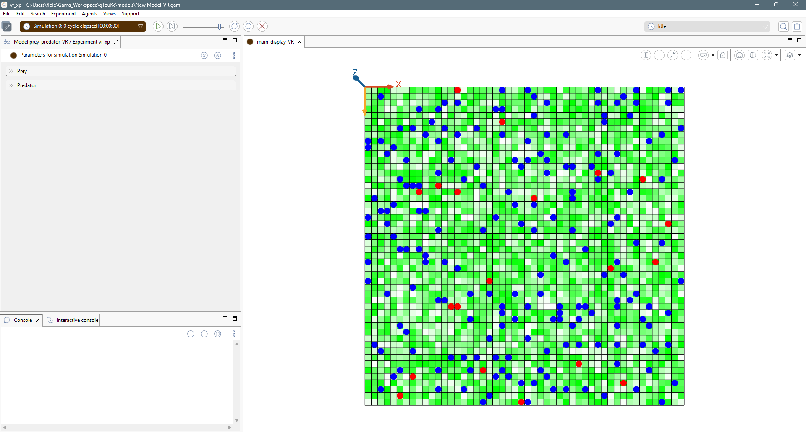

# 2. Prepare a GAMA Experiment for Unity

This chapter explains what the GAMA model must expose so Unity can preview and
render it.

## Unity Linker

A Unity-compatible experiment normally defines a species that extends
`abstract_unity_linker`.

The linker declares:

- the Unity player species;
- the list of Unity properties;
- the species or geometries to send to Unity;
- optional runtime attributes sent with each agent.

Open the target model in GAMA.

Select an experiment that is ready to run.

## Result

At the end of this chapter, the GAMA experiment exposes species, geometries, and
optional attributes that Unity can receive.
