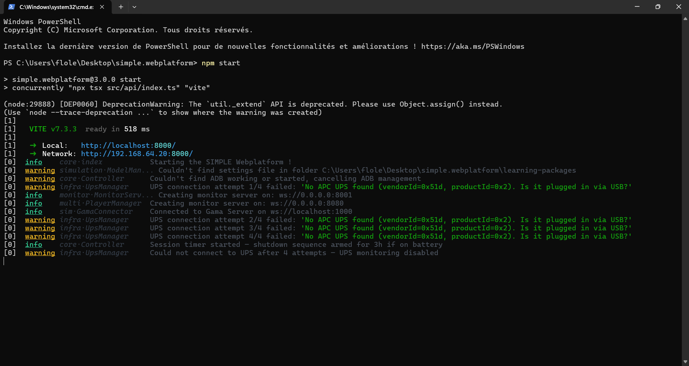
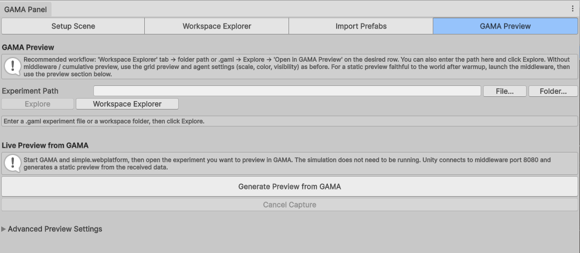
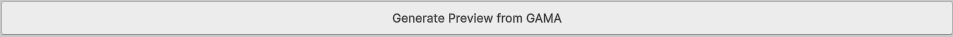
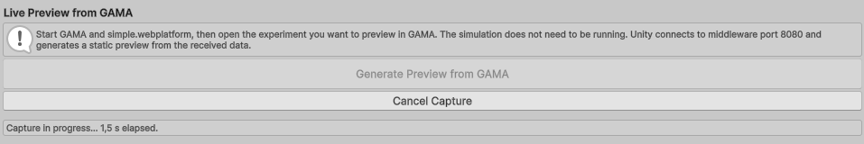
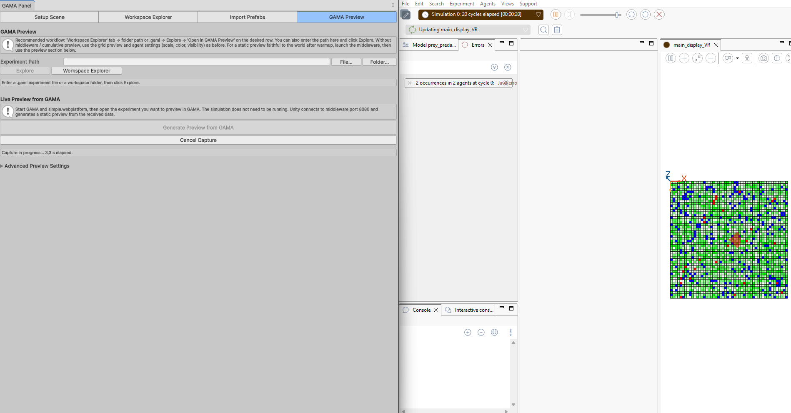
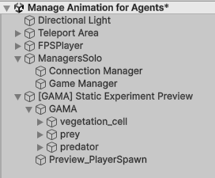
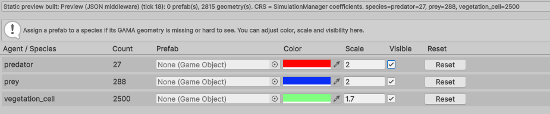

# 3. Generate a GAMA Preview in Unity

This chapter creates a static preview from the GAMA experiment currently opened
or selected in GAMA.

## Steps

1. In `simple.webplatform`, start the middleware before generating the preview.

3. Open or select the target experiment in GAMA.
4. Open **GAMA > GAMA Panel > Generate Preview from GAMA**.

Click **Generate Preview from GAMA**.


During capture, the GAMA Panel shows that the preview is being built.



GAMA may start or update the experiment while Unity receives the preview data.



## Expected Result

The Unity scene should show the map and detected agents without entering Play
Mode.

The GAMA Panel should list detected species in a table similar to:

```text
Agent / Species | Count | Prefab | Color | Scale | Visible | Reset
```

The scene now contains the generated static preview.



The GAMA Panel now contains the detected species settings.



## Important Behavior

Generating a new preview should clean previous generated preview/runtime objects
before rebuilding the scene. This avoids visual superposition with older example
scenes or older previews.


## If Nothing Appears

Check:

- `simple.webplatform` is running;
- GAMA is running;
- the experiment is opened or selected;
- Unity uses the same port as the middleware;
- the GAMA model sends at least one geometry.
