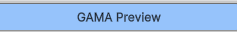

# 3. Generate a GAMA Preview in Unity

This chapter creates a static preview from the GAMA experiment currently opened
or selected in GAMA.

## Steps

1. Start `simple.webplatform`.
2. Start GAMA.
3. Open or select the target experiment in GAMA.
4. Open Unity.
5. Open **GAMA > GAMA Panel**.
6. Click **Generate Preview from GAMA**.

Start the middleware before generating the preview.


Open the preview workflow from the GAMA Panel.



The preview page exposes the GAMA preview controls.


Click **Generate Preview from GAMA**.


Unity receives JSON output from the middleware and builds a static preview under:

```text
[GAMA] Static Experiment Preview
```

During capture, the GAMA Panel shows that the preview is being built.


GAMA may start or update the experiment while Unity receives the preview data.


Wait until Unity finishes building the scene.


## Expected Result

The Unity scene should show the map and detected agents without entering Play
Mode.

The GAMA Panel should list detected species in a table similar to:

```text
Agent / Species | Count | Prefab | Color | Scale | Visible | Reset
```

The scene now contains the generated static preview.


The GAMA Panel now contains the detected species settings.


## Important Behavior

Generating a new preview should clean previous generated preview/runtime objects
before rebuilding the scene. This avoids visual superposition with older example
scenes or older previews.

> Optional before/after screenshots to add: an old generated scene before
> preview, then the cleaned scene after preview generation.

## If Nothing Appears

Check:

- `simple.webplatform` is running;
- GAMA is running;
- the experiment is opened or selected;
- Unity uses the middleware port `8080`;
- the GAMA model sends at least one geometry.
