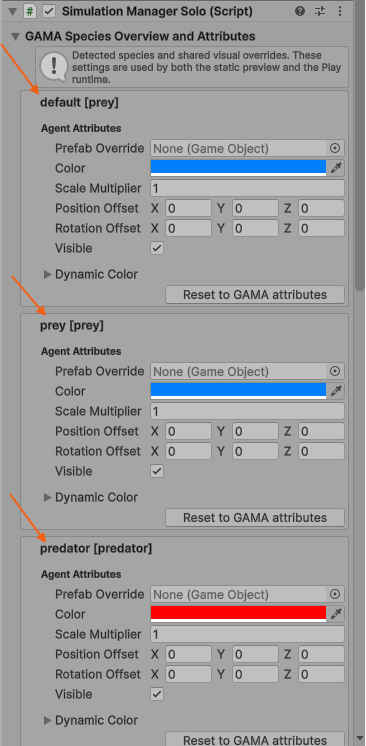
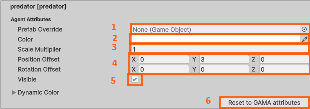

# 3. Personalize Agents During Play Mode

In the previous step, Unity performed a raw import of the GAMA experiment during
Play Mode.

At this stage, the goal is not yet to build the final visual setup. The goal is
to show that the imported GAMA species can be modified live from Unity while the
simulation is running.

## 3.1 Open The Game Manager

Start Play Mode and wait until the GAMA agents appear in the Unity scene.

In the **Hierarchy**, select the object that manages the GAMA connection and
simulation settings:

In the **Inspector** window, find the GAMA agent or species settings. Unity should show
the species detected from the running GAMA experiment.

> [!TIP]
> **Can't find the Inspector?** If the Inspector window is not visible in your Unity layout, you can open it via the top menu: **Window > General > Inspector**, or by pressing `Ctrl + 3` (Windows) / `Cmd + 3` (macOS).
>
> 

For example, here we have the species `prey`, `predator`, and `vegetation_cell`:

## 3.2 Modify Species Attributes Live

Pick one species in the Inspector. You will see several attributes you can modify live.

This lets you quickly verify that Unity can override the visual appearance of a GAMA species without changing the GAMA model itself. The scene should update while Play Mode is still running, or on the next visual refresh received from GAMA.

Using the Inspector, you can change the following attributes directly:

1. **Prefab Override**: Assign a Unity prefab instead of displaying a default geometric shape. For Play Mode runtime loading, the prefab must be placed under a Unity `Resources` folder (e.g., `Assets/Resources/Visual Prefabs/Character/Ghost.prefab`).
2. **Color**: Quickly change the species color to separate them visually.
3. **Scale Multiplier**: Make agents bigger or smaller so they are easier to see.
4. **Position & Rotation Offset**: Adjust the 3D position and rotation of the instantiated prefab relative to the GAMA agent's center.
5. **Visible**: Hide species that are not useful for the Unity view.
6. **Reset to GAMA attributes**: Revert any local changes back to the original attributes sent by GAMA.

This is very useful for quick experimentation because you immediately see whether the selected setup makes sense in the scene.

## 3.4 Why This Is Not The Best Workflow

Live modification proves that the Unity side can customize GAMA agents, but it
is not comfortable for real visual iteration.

You have to:

- launch Play Mode;
- wait for the GAMA experiment to connect;
- wait for the agents to appear;
- modify settings while the simulation is already running;
- restart the workflow when you want to test another setup.

This means you are often tuning the scene after launching it, almost blindly.

To make this easier, the next step introduces the **GAMA Preview** workflow. The
preview lets you generate a static snapshot of the GAMA experiment in Edit Mode,
then adjust colors, prefabs, scale, and visibility before entering Play Mode
again.
