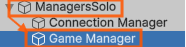

# 3. Personalize Agents During Play Mode

In the previous step, Unity performed a raw import of the GAMA experiment during
Play Mode.

At this stage, the goal is not yet to build the final visual setup. The goal is
to show that the imported GAMA species can be modified live from Unity while the
simulation is running.

## 3.1 Open The Game Manager

Start Play Mode and wait until the GAMA agents appear in the Unity scene.

In the **Hierarchy**, select the object that manages the GAMA connection and
simulation settings:



Depending on the scene setup, this object may also be the object that contains
the `SimulationManager` component.

In the **Inspector**, find the GAMA agent or species settings. Unity should show
the species detected from the running GAMA experiment.

Examples of species can be:

- `pedestrian`
- `wall`
- `building`
- `road`
- `people`

## Change A Species Color

Pick one species in the Inspector and change its color.

This lets you quickly verify that Unity can override the visual appearance of a
GAMA species without changing the GAMA model itself.

For example:

- make `pedestrian` agents blue;
- make `wall` agents dark gray;
- make `road` agents black;
- make `people` agents green.

The scene should update while Play Mode is still running, or on the next visual
refresh received from GAMA.

## 3.2 Assign A Prefab

You can also assign a Unity prefab to a species.

For example, instead of displaying a default geometric shape for `pedestrian`,
you can assign a character prefab.

For Play Mode runtime loading, the prefab should be placed under a Unity
`Resources` folder.

Recommended example:

```text
Assets/Resources/Visual Prefabs/Character/Ghost.prefab
```

Runtime resource path:

```text
Visual Prefabs/Character/Ghost
```

This allows Unity to load the prefab while the simulation is running.

## 3.3 Useful Live Settings

During Play Mode, the most useful settings to test are:

- **Color**: quickly separate species visually.
- **Prefab**: replace simple GAMA geometry with a Unity asset.
- **Scale**: make agents easier to see.
- **Visible**: hide species that are not useful for the Unity view.

This is useful for quick experimentation because you immediately see whether the
selected color, prefab, or scale makes sense in the scene.

## 3.4 Why This Is Not The Best Workflow

Live modification proves that the Unity side can customize GAMA agents, but it
is not comfortable for real visual iteration.

You have to:

- launch Play Mode;
- wait for the GAMA experiment to connect;
- wait for the agents to appear;
- modify settings while the simulation is already running;
- restart the workflow when you want to test another setup.

This means you are often tuning the scene after launching it, almost blindly.

To make this easier, the next step introduces the **GAMA Preview** workflow. The
preview lets you generate a static snapshot of the GAMA experiment in Edit Mode,
then adjust colors, prefabs, scale, and visibility before entering Play Mode
again.
