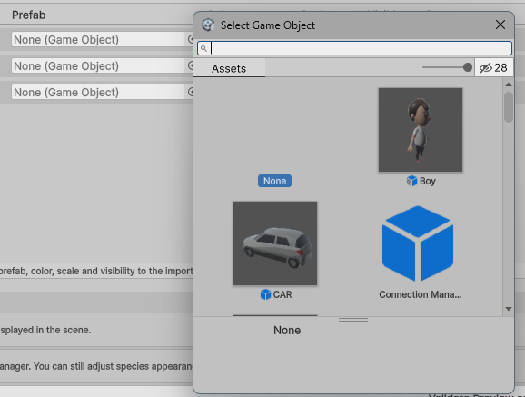

# 4. Configure Species Visuals

This chapter explains how to customize each GAMA species in Unity.

Species settings are shared between:

- the static GAMA Preview in Edit Mode;
- the `Game Manager` / `Simulation Manager` inspector;
- Play Mode runtime agents.

## Available Settings

For each species, configure:

- **Prefab Override**: replace GAMA geometry with a Unity prefab.
- **Color**: override or adjust the species color.
- **Scale Multiplier**: multiply the visual size.
- **Position Offset**: shift the visual representation.
- **Rotation Offset**: rotate the visual representation.
- **Visible**: show or hide the species.
- **Reset to GAMA attributes**: restore default GAMA values for that species.

The preview result lets you edit species settings directly.


## Prefab Rules

For Edit Mode preview, Unity can use a direct prefab object reference.

For Play Mode runtime loading, the prefab should be under a Unity `Resources`
folder so it can be loaded with a resource path.

Recommended example:

```text
Assets/Resources/Visual Prefabs/Character/Ghost.prefab
```

Resource path:

```text
Visual Prefabs/Character/Ghost
```

> Screenshot to add: Unity Project window showing a prefab under
> `Assets/Resources/...`.

You can choose a prefab from the GAMA Panel.



## Scale Rules

The scale multiplier is a visual multiplier.

It should not move the logical agent position or change the global runtime root.
For cell-like species, the logical parent should stay at scale `(1, 1, 1)` and
the visual child should receive the visual scale.

> Screenshot to add: hierarchy/inspector showing a logical cell parent at scale
> `(1, 1, 1)` and its visual child scaled.

> Optional before/after screenshots to add: scale changed from `1` to `2`
> without changing cell spacing.

## Result

At the end of this chapter, species look correct in the static preview and the
same settings are ready for Play Mode.
