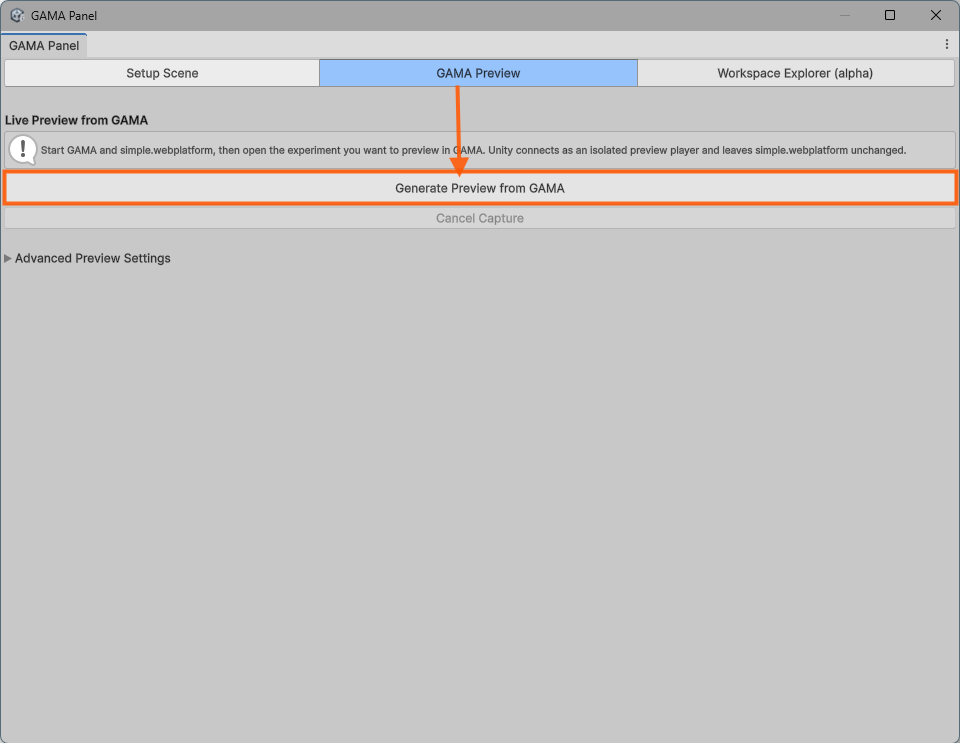
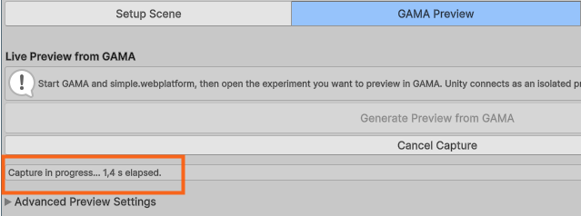
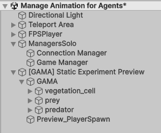
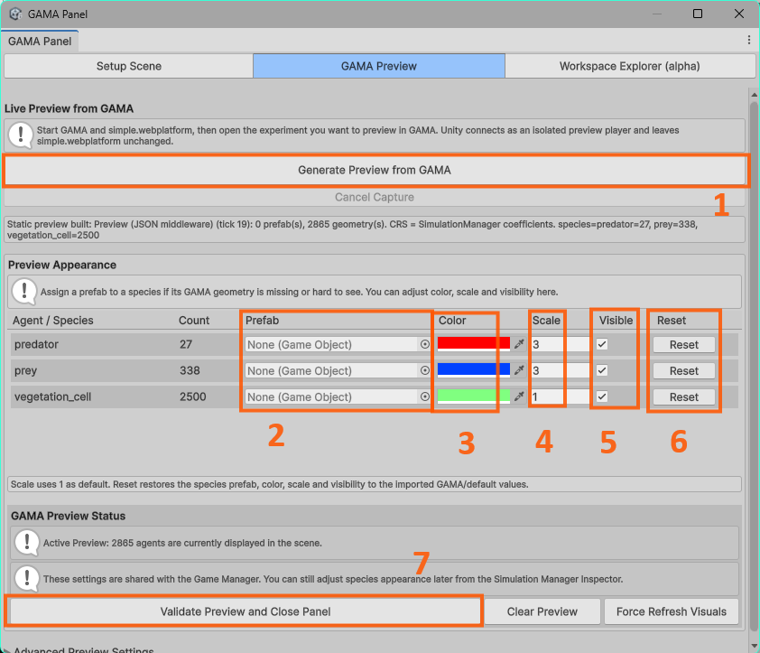
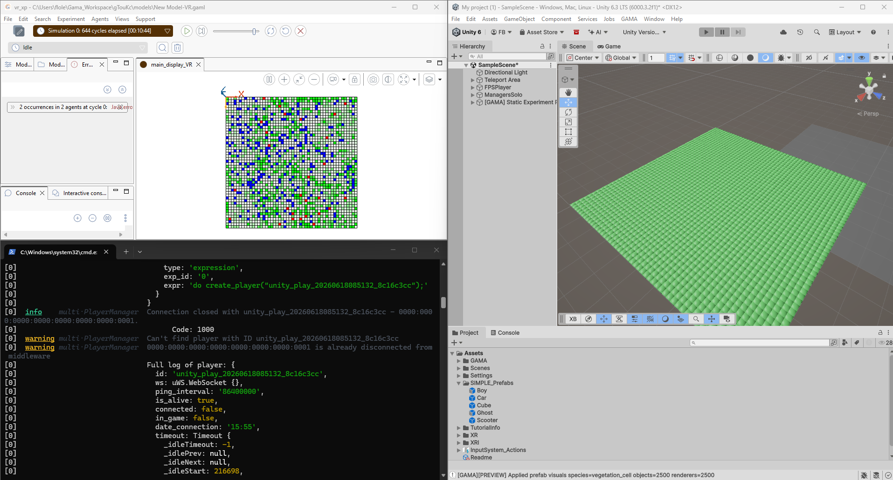
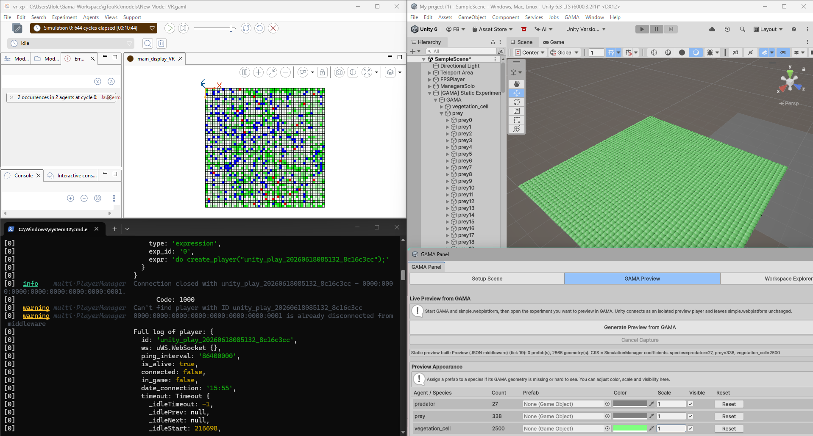
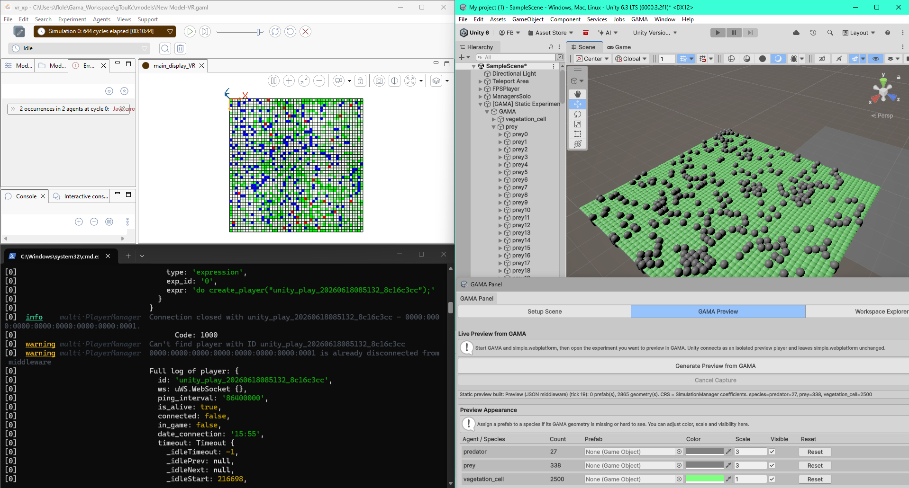
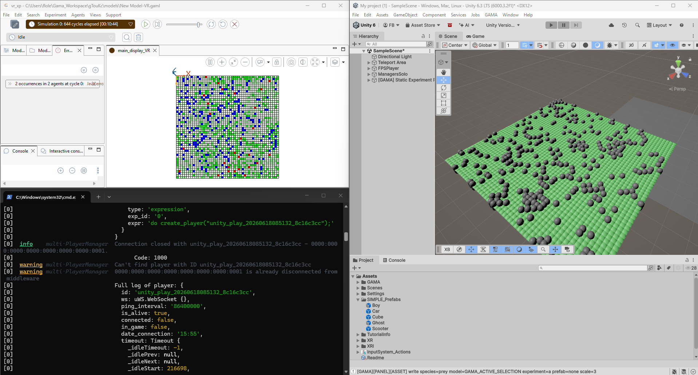
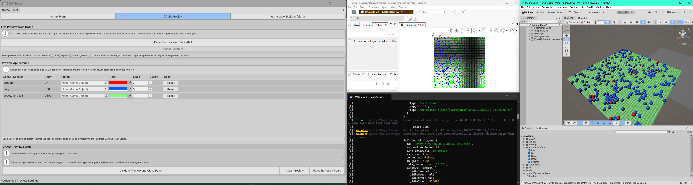
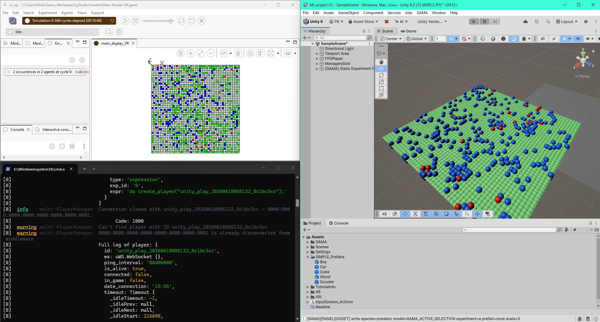

# 4. Generate and Configure the Unity Preview

After validating the Play Mode, we'll generate a static preview to inspect the scene in
Unity Edit Mode.

The preview is useful because it lets you tune visual parameters without
launching the full live experiment every time.

## 4.1 Generate The Preview

Open **GAMA > GAMA Panel > Generate Preview from GAMA**.

During capture, the GAMA Panel shows that the preview is being built.

GAMA may start or update the experiment while Unity receives the preview data.

## 4.2 Expected Result

The Unity scene should show the map and detected agents without entering Play
Mode.

The scene now contains the generated static preview.

## 4.3 Parameters You Can Modify In The Preview

For each detected species, the preview exposes visual settings that can later be
applied to Play Mode runtime agents:

1. **Info**: details about the captured static preview data.
2. **Prefab**: replace the default GAMA geometry with a Unity prefab.
3. **Color**: force a stable color for the species.
4. **Scale**: change the visual size without changing the logical scale.
5. **Visible**: show or hide the species in preview and runtime.
6. **Reset**: return the species to the values received from GAMA.
7. **Validate**: apply the settings to your Unity agents and close the panel.

## 4.4 Preview Configuration Example

With the **Prey Predator 7** model, start by checking that the static background
species is visible. Here, only the vegetation grid is clearly displayed in the
Unity preview.

The GAMA Panel can be used to keep the vegetation visible while preparing the
other species.

Then enable the prey and predator species and increase their scale in the GAMA
Panel. Before assigning colors, they appear as grey points on top of the
vegetation grid.

Finally, assign stable colors to distinguish the two dynamic species. In this
example, prey are blue and predators are red.

## Important Behavior

Generating a new preview should clean previous generated preview/runtime objects
before rebuilding the scene. This avoids visual superposition with older example
scenes or older previews.

## Result

At the end of this chapter, the static preview should look close to the desired
Unity scene, and the same species settings should be ready to reuse in Play
Mode.
