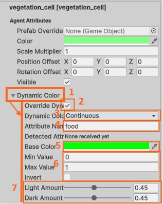
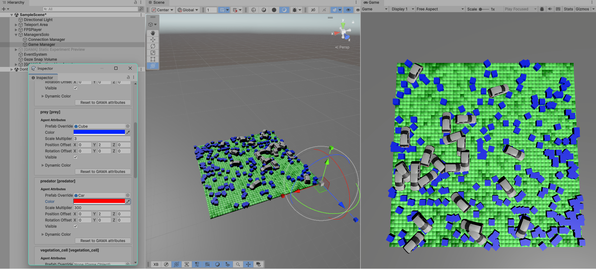
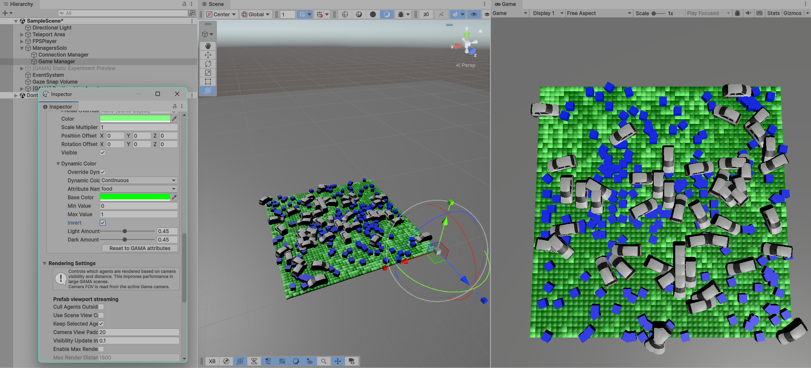

# 5. Dynamic Colors From GAMA Attributes

Static species settings are not always enough. Some visual properties should be
driven by values coming from GAMA.

After generating the preview, dynamic colors can be configured in Unity Edit
Mode from the Inspector. In the **Prey Predator 7** model, a useful example is
the `food` attribute of each `vegetation_cell`: instead of showing every grass
cell with the same green, Unity can use a more or less intense green depending
on the `food` value, like in the GAMA display.

## Attribute Requirements

The GAMA model must send the attribute in `add_geometries_to_send(...)`.

The attribute list must stay aligned with the agent list sent to Unity.

Example boolean attribute:

```gaml
list<bool> people_infected <- people collect each.is_infected;
map<string, list<bool>> people_atts <- ["is_infected":: people_infected];

do add_geometries_to_send(people, up_people, people_atts);
```

Example numeric attribute:

```gaml
list<float> prey_energy <- prey collect each.energy;
map<string, list<float>> prey_atts <- ["energy":: prey_energy];

do add_geometries_to_send(prey, up_prey, prey_atts);
```

## Continuous Example: Vegetation Food

Use this mode when an attribute is numeric and should produce a gradual visual
change.

In this example, the `vegetation_cell` species receives a numeric `food`
attribute. The goal is:

```text
low food  -> lighter/darker green
high food -> stronger green
```

Steps:

1. Select the `Game Manager`.
2. In the Inspector, find `vegetation_cell`.
3. Open the **Dynamic Color** foldout.
4. Enable **Override Dynamic Color**.
5. Set **Dynamic Color Mode** to **Continuous**.
6. Set **Attribute Name** to `food`.
7. Set **Base Color** to green.
8. Set **Min Value** and **Max Value** to the expected GAMA range.
9. Adjust **Light Amount** and **Dark Amount** until the contrast is readable.

The numbered close-up below shows the important controls:



1. Open the **Dynamic Color** foldout.
2. Enable the override.
3. Choose **Continuous** mode.
4. Enter the attribute name, here `food`.
5. Pick the base color.
6. Set the numeric range.
7. Tune the light and dark variation.

Before enabling the dynamic color rule, the preview already shows the species
with static colors and prefabs, but the grass cells do not yet reveal their
individual `food` values.



After enabling the `food` dynamic color on `vegetation_cell`, each grass square
uses its own GAMA value to modulate the green color. This makes the food
distribution easier to read directly in Unity.



## Discrete Colors For States

Continuous colors are useful for numeric values such as food, energy, pollution,
health, infection probability, or hunger.

For attributes that represent a small set of states, use **Discrete** mode
instead. This is useful for experiments with states such as:

- contaminated, dead, or recovered agents;
- voters choosing between several opinions;
- agents belonging to different roles or categories.

For example:

```text
state = contaminated -> red
state = recovered    -> green
state = dead         -> black
```

## Runtime Behavior

Dynamic colors are applied per agent when Unity receives GAMA attributes.

They do not replace the static preview workflow:

- the preview defines the default species representation;
- dynamic rules define how individual agents change from their own attributes;
- if the attribute is missing or cannot be parsed, Unity keeps the static/GAMA
  color instead of crashing.

## Result

At the end of this chapter, Unity should be able to show both static species
settings and per-agent attribute variations, such as vegetation cells becoming
more or less green depending on their `food` value.

## Navigation

| Previous | Next |
|---|---|
| [4. Generate and Configure the Unity Preview](04-generate-preview.md) | [6. Configure Species Appearance](06-configure-species.md) |
