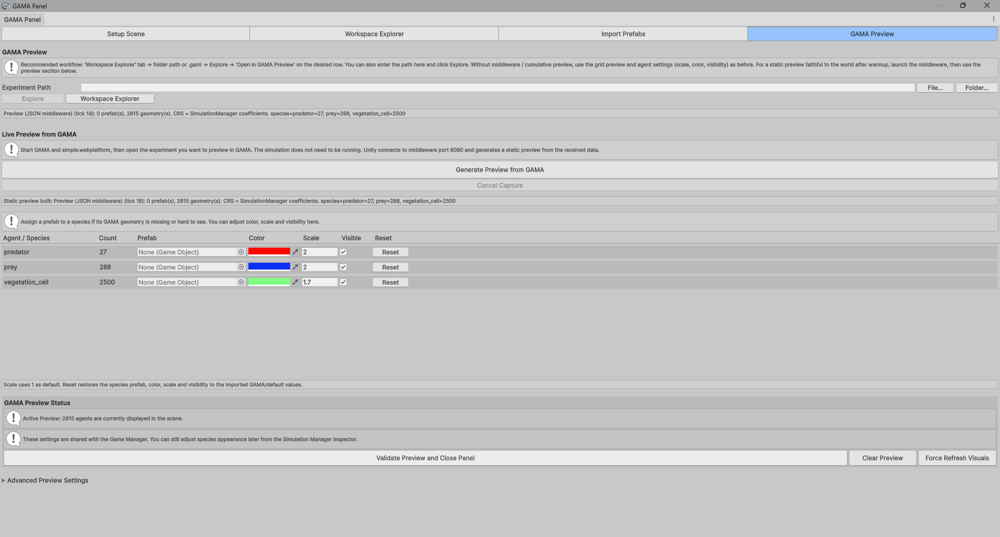
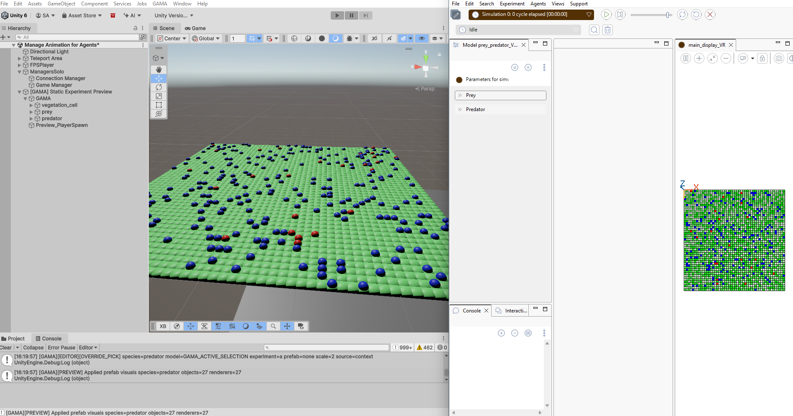
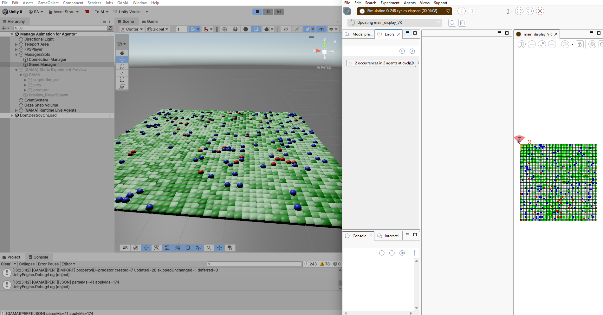

# 5. Run the Live Preview from GAMA

This chapter runs the Unity scene in Play Mode and receives live agents from
GAMA through `simple.webplatform`.

## Steps

1. Generate a static preview.
2. Configure species visuals.
3. Click **Validate Preview and Close Panel**.
4. Press **Play** in Unity.

Validate the preview when the species settings are correct.



Then press **Play** in Unity.



Runtime agents are created under:

```text
[GAMA] Runtime Live Agents
```

When Play Mode works, the static preview objects are hidden and runtime objects
are created.



## Runtime Behavior

During Play Mode:

- Unity connects to `simple.webplatform`;
- static preview objects are hidden when live runtime data is available;
- live agents are created, updated, and removed by stable agent id;
- species settings from the preview are applied to runtime agents.

> Screenshot to add: Console logs showing successful connection and live JSON
> flow.

> Optional GIF to add: agents moving in Unity while GAMA runs.

## Dynamic Agents

Dynamic agents should be synchronized by:

```text
speciesName + "::" + agentId
```

Expected behavior:

- existing agents update instead of duplicating;
- newborn agents appear;
- dead agents disappear after a complete live update;
- static/background species are not pruned just because they are absent from a
  live tick.

## Player Position

By default, outgoing Unity player position should come from the Main Camera world
position.

This avoids sending the `Game Manager`, `Connection Manager`, or a fixed root
position as the player position.

> Screenshot to add: `Game Manager` player position source settings.

> Screenshot to add: Console log `[GAMA][OUT][PLAYER_POS]` showing
> `source=MainCamera`.
